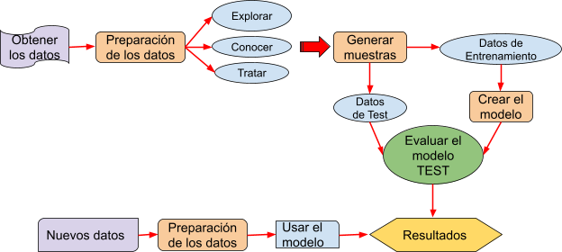

# Machine Learning con Scikit-learn

Este es un modelo de clasificación, Usa RandomForest, SVC y Naive Bayes

## ML 101

1. EDA
2. Separar los datos de training y test
3. Escalar
4. Entrenar el modelo
5. Comparar que tan bueno es el modelo con matriz de confusión
6. Estimar los datos que se quieren

## Docs

1. [Ciencia de datos](https://www.cienciadedatos.net/documentos/41_machine_learning_con_r_y_caret#Introducci%C3%B3n)
2. [Machine Learning with Python](https://machinelearningmastery.com/machine-learning-in-python-step-by-step/)
3. [Tutorialspoint](https://www.tutorialspoint.com/machine_learning_with_python/machine_learning_with_python_applications.htm)
4. [Kaggle](https://www.kaggle.com/learn/overview)
5. [scikit-learn documentación](https://scikit-learn.org/stable/)